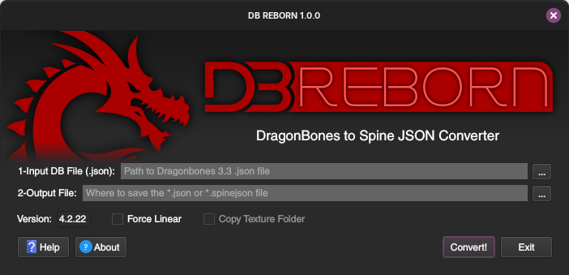
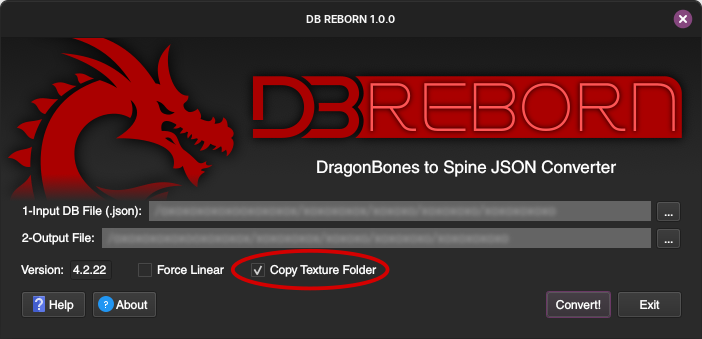
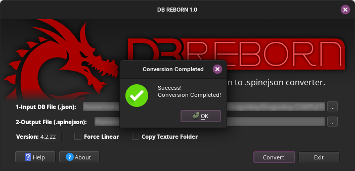
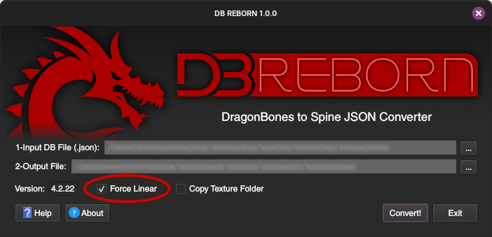
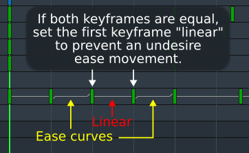
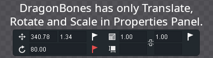

[Read this in Portuguese (Leia em Português)](README_PT-BR.md)

  
  
  
  

# DB Reborn

### A tool to convert DragonBones JSON (v3.3) to Spine JSON for use in Game Animations.

## Introduction

DB Reborn is a free, open-source tool that converts animations from the classic DragonBones editor into the modern Spine JSON format. This allows you to use your DragonBones animations in a wide range of popular game engines and frameworks.

While originally created for the **Defold Game Engine**, DB Reborn is a universal bridge for any developer looking for a free cutout animation pipeline. By generating a standard Spine JSON file, it makes your animations compatible with engines like **Godot, Unity, GameMaker** and many more.

**Who is this for?**

* **DB Reborn is ideal for:** Hobbyists and indie developers looking for a free pipeline to bring DragonBones animations into their chosen game engine.
* **For professional work:** If you need advanced features and dedicated support, we highly recommend purchasing a [Spine license](http://esotericsoftware.com/ ).

## Engine Compatibility

DB Reborn generates a standard Spine JSON file, making it compatible with virtually any game engine that has a Spine runtime. The output dropdown allows you to select the correct file extension for your target engine.

* **`.json` (Default):** For **Godot, Unity, GameMaker, Phaser, Cocos2d-x, LibGDX,** and most other engines.
* **`.spinejson` (Specific):** The conventional extension for the **Defold Game Engine**.

If your engine or framework supports Spine JSON, it will work with DB Reborn.

## **IMPORTANT NOTICE**

This project is a file format conversion tool and is not affiliated with Esoteric Software. The purpose of generating files in the Spine JSON format is to enable interoperability. Please remember that to use the exported animations in your game with the official Spine Runtimes, you and/or your company may need to purchase an appropriate Spine license, in accordance with Esoteric Software's terms of service.

## How to Use

💥 You can find a sample project in the example/ folder to test the conversion process immediately 💥

### 1. Create Your Animation

- Create your animation in **DragonBones 5.6.2**.
- **Requirements:** Your project must contain at least 1 armature, 1 bone, 1 slot with 1 skin, and 1 animation.

### 2. Export from DragonBones

- Export your project with **Data Type: `JSON`** and **Data Version: `3.3`**.
- Ensure images are exported at **100% scale**.
- **Important:** Do not use texture atlases during export. The tool requires individual `.png` sprites.
- After exporting, you will have a `YOUR_FILE.json` and a `YOUR_FILE_TEXTURES` folder.

### 3. Run DB Reborn

1. Go to the [Releases page](https://github.com/rfm-code-dev/DB-Reborn/releases) on GitHub.
2. Download the executable for Windows, Mac or Linux.
3. Run the app.

   

4. Click the first "..." button to select your input `.json` file 3.3 generated from Dragonbones.
 
   
   *Note: After selecting the `.json` file, DB Reborn will perform a series of checks to ensure it meets the required standard for a successful conversion. Three pop-up windows will appear in sequence: one indicating that the `.json` file appears to be OK, another confirming that the `YOUR_FILE_TEXTURES` folder was found and a final one verifying that this folder contains the project's images. Simply click the "OK" button on each pop-up to proceed.*

5. Click the second "..." button to select the output folder and the file. Choose the file extension (`.json` or `.spinejson`).
   
   
   
   *Note: If you choose an output folder different from the one where the input `.json` is located, DB Reborn will turn the 'Copy Texture Folder' checkbox active, leaving you to copy the `YOUR_FILE_TEXTURES` folder to the new location. Just check the corresponding checkbox. If you only wish to generate the `.json` or `.spinejson` file without copying the textures, leave the checkbox unchecked.*

6. Click **Convert!**
   
   

### 4. Import into Defold Game Engine

1. Copy the generated `YOUR_FILE.spinejson` and the `YOUR_FILE_TEXTURES` folder into your Defold project.
2. In your `game.project` file, add the [Spine extension dependency](https://defold.com/manuals/spine/).
3. Create a new **Atlas** in Defold and add all the images from the `YOUR_FILE_TEXTURES` folder.
4. Create a new **Spine Scene** (`.spinescene`) and assign your `.spinejson` file and the Atlas you just created.
5. Add a **Spine Model** component to a Game Object and select the new Spine Scene.
6. Use a script to play your animation, e.g., `spine.play("#spinemodel", "your_animation_name")`.

## Known Issues & Limitations

- **Easing Curves #1:** The script attempts to convert easing curves. If your animation causes Defold to crash, try re-converting with the **"Force Linear"** checkbox enabled. This will change all transitions to be linear.
  
  

  - **Easing Curves #2:** As DB Reborn converts automatically all the keyframes with ease curves, if you use ease curves in all keyframes, all will be converted. It may results in some undesired motions if in some cases there are two equal keyframes and you wish not move between this gap. So I recommend you to set this first keyframe to linear to prevent this.
  
  

- **Shear Properties:** DragonBones automatically generates "shear" keyframes in its JSON output, even though there is no interface to control them. To prevent potential issues in Defold, DB Reborn removes all shear *curves*, leaving only the base time keys, which do not affect the final animation.
  
  

## Support & Contribution

- For tutorials and updates, visit the [YouTube Channel](https://www.youtube.com/@rfmcodedev).
- Please report any bugs by sending an email to [rfm.code.dev@gmail.com](mailto:rfm.code.dev@gmail.com).

## ❤️ Support the Project

If this project helped you, consider buying me a coffee! Every little bit helps me dedicate more time to open-source development.

  

Enjoy!
